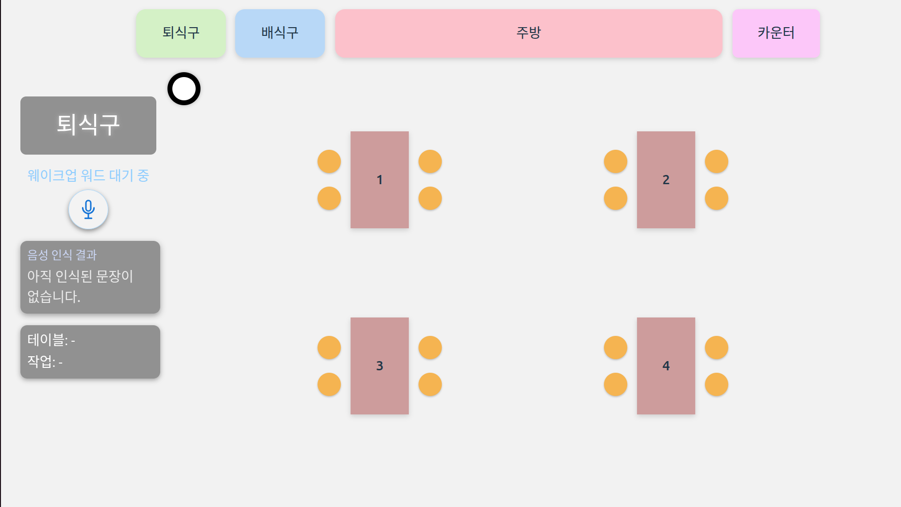
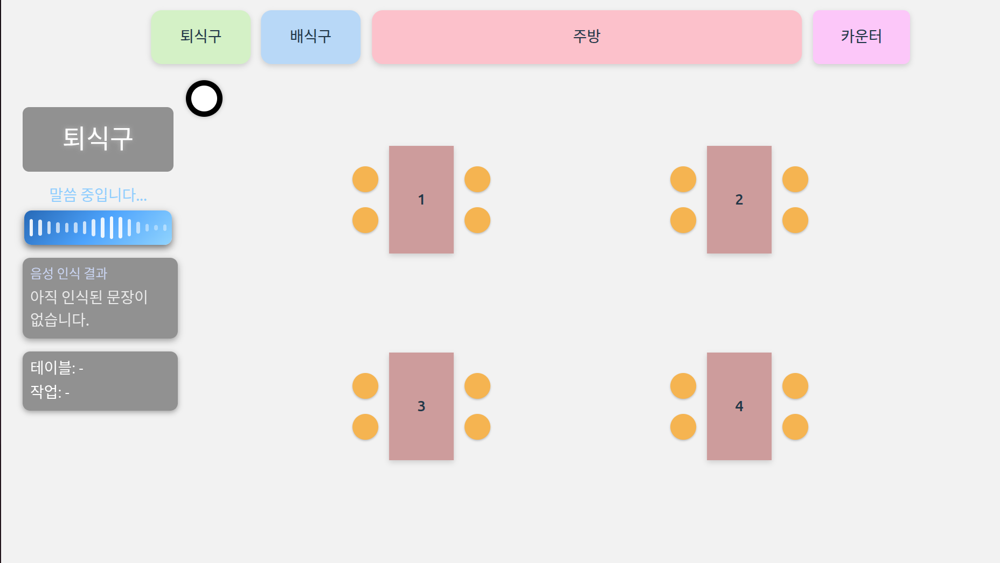
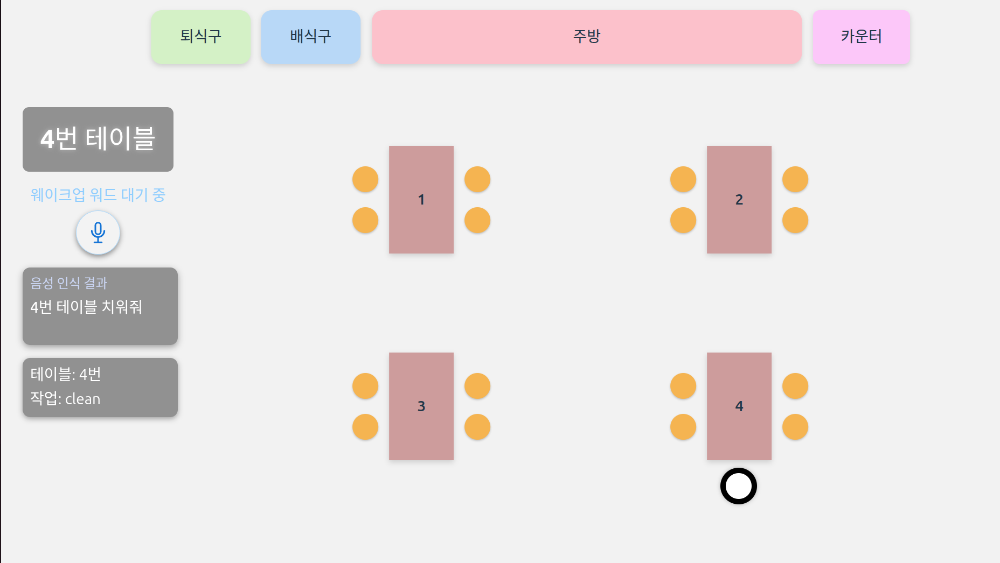

# BussingMate
BussingMate is an integrated robotics system that enables a robot to automatically clean and set tables in restaurant environments.
It combines ROS2, YOLO-based perception, reinforcement learning for motion/decision policies, LLM-based voice command parsing, and a real-time React/Vite GUI.


## 🧩 환경 및 설치 가이드 (Installation)

### 1. 사용 환경 (Environment)

- OS: Ubuntu 24.04 LTS
- ROS2: Jazzy  
- Python: 3.12.x
- Node.js: 24.11.1
- npm: 11.6.2

> ⚠ 이 프로젝트는 **ROS2 + Python 노드 + FastAPI(WebSocket) + React GUI** 를 함께 사용합니다.  
> ROS2 워크스페이스와 Node.js 환경이 모두 필요합니다.

---

### 2. ROS2 워크스페이스 & 패키지 구성

```bash
# ROS2 워크스페이스 생성 (이미 있다면 생략)
mkdir -p ~/llm_ws/src
cd ~/llm_ws/src
```
```bash
# 프로젝트 클론
git clone https://github.com/your-org/YongYiHanYong.git
cd YongYiHanYong
```

---

### 3. Python 가상환경 생성 (Strongly Recommended)
Ubuntu 24.04에서는 pip가 시스템 환경을 보호하기 때문에
반드시 가상환경(venv) 사용을 권장합니다.
``` bash
cd ~/llm_ws/src/YongYiHanYong

python3 -m venv .venv
source .venv/bin/activate
```

---

### 4. Python 의존성 설치 (requirements.txt)

아래는 프로젝트에서 필요한 파이썬 의존성입니다:

requirements.txt:
``` txt
scipy
openwakeword
sounddevice
python-dotenv
pyaudio
onnxruntime
langchain-openai
langchain-core
langchain-classic
openai
fastapi
uvicorn
numpy
```

설치:
``` bash
pip install --upgrade pip
pip install -r requirements.txt
```
---

### 5. OpenAI API 키 설정 (.env)

음성 명령 파싱을 위한 LLM 호출은 .env 파일에서 API 키를 읽습니다.
```bash
nano ~/llm_ws/src/YongYiHanYong/llm_for_pick_place_voice/resource/.env
```
예시:
``` env
OPENAI_API_KEY=sk-xxxxxx_your_key_here
```

---

### 6. ROS2 빌드
``` bash
cd ~/llm_ws

# ROS2 기본 환경 로드
source /opt/ros/jazzy/setup.bash

# 워크스페이스 빌드
colcon build --symlink-install

# 오버레이 적용
source install/setup.bash

```
⚠ package.xml과 setup.py에서
get_keyword · ros_web_bridge 노드를 entry point로 등록해야
ros2 run 명령을 사용할 수 있습니다.

---

### 7. ROS2 노드 실행
## 7-1. 음성 명령 트리거 클라이언트 노드 (get_keyword_client)
get_keyword 서비스에 한 번 요청을 보내
웨이크업 워드 감지 → STT → LLM 파싱을 한 사이클 수행시키는 클라이언트 노드입니다.
``` bash
cd ~/llm_ws
source /opt/ros/jazzy/setup.bash
source install/setup.bash
ros2 run llm_for_pick_place_voice get_keyword_client
```
참고: get_keyword_client 대신 직접 서비스 호출로 테스트할 수도 있습니다.
``` bash
ros2 service call /get_keyword std_srvs/srv/Trigger "{}"
```

## 7-2. LLM + STT 음성 처리 서버 노드 (get_keyword)
``` bash
cd ~/llm_ws
source /opt/ros/jazzy/setup.bash
source install/setup.bash
ros2 run llm_for_pick_place_voice get_keyword
```

## 7-3. ROS & Web Bridge (FastAPI WebSocket 서버)
``` bash
cd ~/llm_ws
source /opt/ros/jazzy/setup.bash
source install/setup.bash
ros2 run llm_for_pick_place_voice ros_web_bridge
```
---

### 8. React GUI 실행
이 GUI는 **React + Vite** 기반으로 구현되어 있으며,  
모든 프론트엔드 의존성은 `package.json` 에 정의되어 있습니다.

GUI 소스 위치:
``` bash
cd ~/llm_ws/src/YongYiHanYong/src/bussing_gui/robot-topview
```
## 8-1. Node 패키지 설치
``` bash
npm install
```
## 8-2. 실행
``` bash
npm run dev
```
브라우저에서 표시된 주소(예: `http://localhost:5173`)로 접속하면
Top View GUI와 음성 상태 패널을 확인할 수 있습니다.

---


## 🔁 GUI 프로세스 및 사용 가이드

이 프로젝트는 **ROS2 + LLM → WebSocket → React** 구조로 동작하며,
음성 입력에서 GUI 로봇 이동까지 다음 순서로 진행됩니다.

1. **웨이크업 워드 감지**  
   ROS2 노드가 마이크 스트림에서 wakeup word("Alexa")를 감지합니다.

2. **음성 인식(STT)**  
   감지 후 6초간 음성을 녹음하고 텍스트로 변환합니다.

3. **LLM 기반 명령 파싱**  
   변환된 문장을 LLM(GPT-4o)에 전달해  
   `table` 과 `action(clean/setting)` 을 추출합니다.
   table의 경우 1~4번만 유효합니다.

4. **ROS → WebSocket 브로드캐스트**  
   추출된 명령과 음성 상태는 WebSocket(`/ws/keywords`)으로 전송됩니다.

5. **React GUI 업데이트**  
   브라우저는 WebSocket 이벤트를 받아 
   테이블/작업을 표시하고 로봇 Dot 이동을 시작합니다.

6. **로봇 Dot 애니메이션 이동**  
   로봇 Dot은 경유지(PATH_MAP)를 따라 목표 테이블까지 애니메이션으로 이동합니다.

7. **도착 이벤트 React → ROS2 전송**  
   - 도착 시 WebSocket(`/ws/robot_events`)으로 ROS에  
   `"arrived:<table>"` 메시지를 보내 후속 로봇 작업을 트리거합니다.
   - ROS의 로봇 제어 노드가 해당 테이블에서 실제 동작(clean/setting)을 수행합니다.
   - **모든 작업이 완료되면, 다시 웨이크업 워드로 새로운 음성 명령을 입력할 수 있습니다.**


## 📸 실제 실행 화면 (GUI)
- GUI는 2D top-view 기반이며, 좌측 패널에서 음성 입력 상태, 인식된 명령,  
및 현재 이동 중인 목표 테이블 정보를 확인할 수 있습니다.

### 1) 시작 화면 (Idle)
프로그램 실행 직후 로봇은 기본 위치에 있으며 마이크는 웨이크업 워드 대기 상태입니다.



### 2) 웨이크업 워드 감지 후 음성 명령 입력 화면 (Listening + STT)
웨이크업 워드가 감지되면 마이크가 Listening 상태로 전환되고 사용자의 음성 명령(STT 결과)이 화면에 실시간으로 표시됩니다.



### 3) 로봇 이동 화면 (Moving)
LLM이 분석한 테이블/작업 정보에 따라 로봇 Dot이 해당 테이블까지 애니메이션으로 이동하는 장면입니다.



